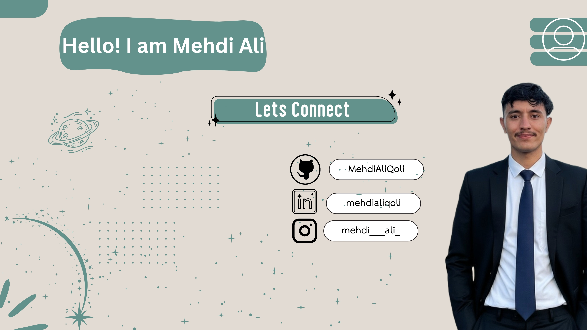

  

I build things that solve real problems for real people. 
Currently focused on making quality education accessible to every Pakistani student through open source.

  

---

<strong><code>CS</code></strong> &nbsp; Studying Computer Science at <strong>IBA Karachi</strong> (Spring 2026) &nbsp;·&nbsp; <strong><code>PK</code></strong> Based in <strong>Karachi, Pakistan</strong>

---

**Interests**
- Cybersecurity and ethical hacking
- Full-stack web applications with real-world impact
- Coursework: AI · Computer Architecture · Networking · Theory of Computation

---

**GitHub Streak**

---

**Languages & Tools**

---

**Connect**

&nbsp;

